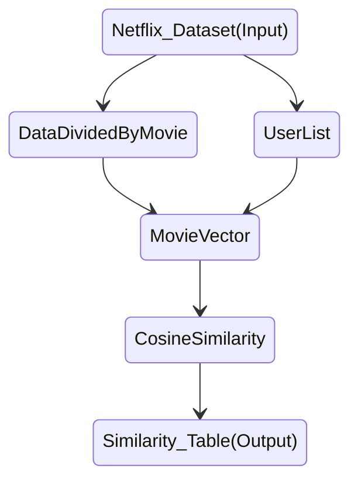

# recommendation-system
A recommendation system built on top of Hadoop Distributed File System and MapReduce

## Background
The whole system runs on a cluster of AWS EC2 instances with the SunU-Hadoop-Image v1.3 AMI, where it is configured with 1 master node and 5 slave nodes, all of which uses the `t2.large` instance type.

### MapReduce Flow
The flow of task orchestrating follows the flow below:


**UserList** \
Key: "$User_List" \
Pair: UserID \
_Eg. "$User_List" = 1025579_

**DataDividedByMovie** \
Key: MovieTitle \
Pair: (UserID, Rating) \
_Eg. Character = (1025579, 4)_

**MovieVector** \
Key: MovieTitle \
Pair: VectorSpace \
_Eg. Character = [4, 0, 5, 0, 0, ...]_

**CosineSimilarity** \
Key: (MovieTitle, MovieTitle) \
Pair: SimilarityScore \
_Eg. (Character, Captain Blood) = 0.2121_

## Data 
The original dataset comes from Netflix Kaggle Competition Page [[Click Here](https://www.kaggle.com/datasets/netflix-inc/netflix-prize-data)]
```
|-- data
|   |-- combined_data_1.txt
|   |-- combined_data_2.txt
|   |-- combined_data_3.txt
|   |-- combined_data_4.txt
|   |-- movies_titles.csv
|   |-- ...
```

Data Cleaning was done using the `script/processing.sh` script to merge and aggregate the data to form the structure below.
```
|-- data
|   |-- ...
|   |-- cleaned_ratings.csv
|   |-- cleaned_titles.csv
|   |-- cleaned_moviesTitles.csv
|   |-- sample
|   |-- ...
```
For the sample, it is obtained by running 
```bash
split -b 500M data/cleaned_moviesTitles.csv sample
```
Here is the link to the S3 bucket to directly download the cleaned dataset [[Download](https://netflix-big-data-assignment.s3.amazonaws.com/datafiles.zip)]

**Note:** \
The data cleaning can only be done on a local instance without MapReduce due to the format and structure of `combined_data_*.txt` file. 
Preferably perform it with `instances type of (t2.xlarge)` with the EBS volume size set to at least `(20 GiB)`.

## File Structure
Below is the structure used in organising files in both the HDFS and Local Linux Directory.

Directory Structure (Local):
```
/home/hadoop/recommendation-system
|-- src
|   |-- java_mapreduce
|   |   |-- javamr.jar
|   |   `-- solution
|   |       |-- UserList.java
|   |       |-- DataDividedByMovie.java
|   |       |-- MoviesVector.java
|   |       `-- CosineSimilarity.java
|   |-- py_mapreduce
|   |   |-- UserList_Mapper.py
|   |   |-- UserList_Reducer.py
|   |   |-- DataDividedByMovie_Mapper.py
|   |   |-- DataDividedByMovie_Reducer.py
|   |   |-- MoviesVector_Mapper.py
|   |   |-- MoviesVector_Reducer.py
|   |   |-- CosineSimilarity_Mapper.py
|   |   `-- CosineSimilarity_Reducer.py
|   |-- py_mrjob
|   |   |-- UserList.py
|   |   |-- DataDividedByMovie.py
|   |   |-- MoviesVector.py
|   |   `-- CosineSimilarity.py
|   `-- main.py
|-- preprocessing
|   |-- RatingsPreprocessing.py
|   |-- TitlesPreprocessing.py
|   `-- CombineMovieTitles.py
|-- script
|   |-- preprocessing.sh
|   |-- local_mapreduce.sh
|   |-- py_mapred_streaming.sh
|   |-- py_mrjob.sh
|   |-- java_mapreduce.sh
|   |-- java_py_mapreduce.sh
|   `-- recommendMovie.sh
|...
```

Directory Structure (HDFS):
```
/user/hadoop
|-- netflix_data
|   |-- sample
|   `-- cleaned_moviesTitles.csv
`-- results
    |-- local_mapreduce
    |-- py_mapred
    |-- py_mrjob
    |-- java_mapreduce
    `-- java_py_mapreduce
```

